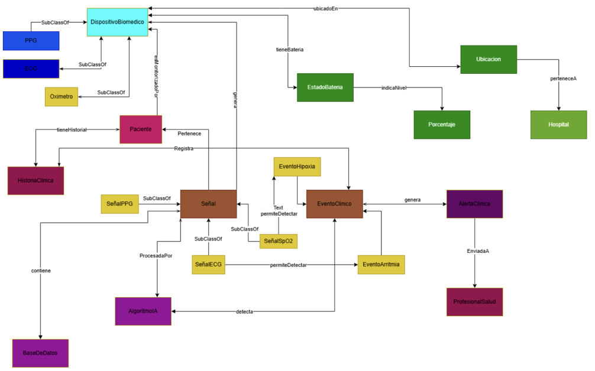

# Biomedical Ontology

### Semantic Knowledge Representation and Ontology Development

## Project Overview

This project focuses on the design and development of a structured ontology using semantic web technologies to represent domain knowledge, define concepts, and establish relationships between entities.

The ontology was developed as part of an academic project, applying knowledge representation principles and ontology modeling techniques.

## Project Objectives

- Structure domain knowledge through an ontology.
- Define concepts, classes, and relationships.
- Represent knowledge using semantic web standards.
- Organize information to support semantic interpretation and knowledge reuse.
- Explore the application of ontologies in intelligent information systems.

## Technologies and Tools

- **Protégé** – Ontology design and development.
- **OWL (Web Ontology Language)** – Formal knowledge representation.
- **RDF (Resource Description Framework)** – Structured knowledge representation.
- **SPARQL** – Semantic query language.

## Ontology Architecture

The following diagram presents the conceptual structure of the ontology and its relationships.

  

## Ontology Development

The project involved the organization of domain concepts and the definition of relationships between entities using an ontology modeling environment.

The resulting ontology is represented in a machine-readable format, enabling its inspection and potential reuse in semantic applications.

## Key Components

- **Classes:** Representation of domain concepts.
- **Properties:** Definition of relationships and attributes.
- **Individuals:** Specific instances represented within the ontology, where applicable.
- **Ontology Structure:** Organization of concepts and their semantic relationships.

## Potential Applications

Ontology-based knowledge representation can support:

- Semantic information organization.
- Knowledge modeling and reuse.
- Intelligent information systems.
- Structured data interpretation.
- Knowledge-based applications.

## Limitations

This project was developed in an academic context. Further validation, consistency checking, and domain-specific evaluation would be required before applying the ontology in a production environment.

## Future Improvements

- Expand the ontology with additional concepts and relationships.
- Perform consistency validation using Protégé reasoners.
- Develop SPARQL queries for knowledge retrieval.
- Explore integration with intelligent systems and data applications.

## Author

**Michelle Morales Martínez**

Biomedical Engineer | AI & Data Analytics Specialist

Universidad de Caldas

[GitHub Profile](https://github.com/MichelleM22)
